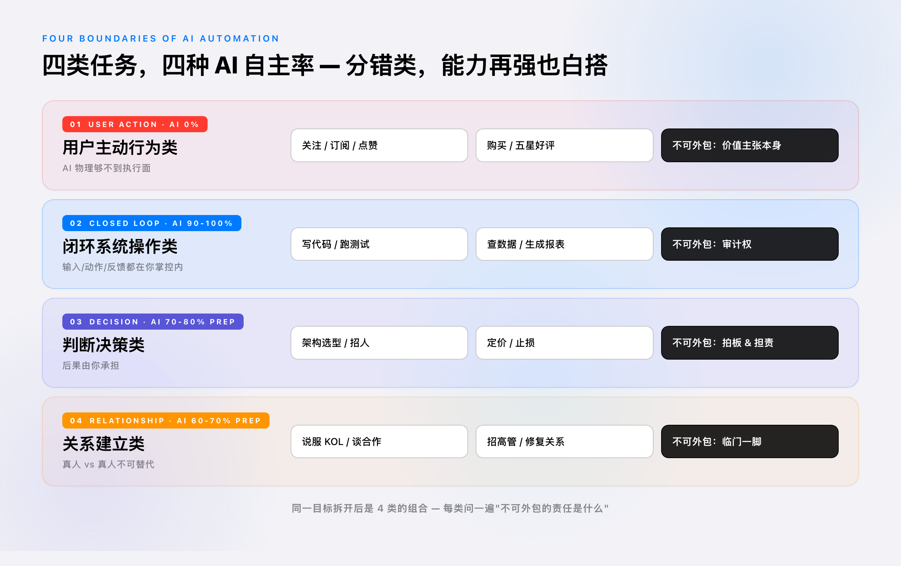
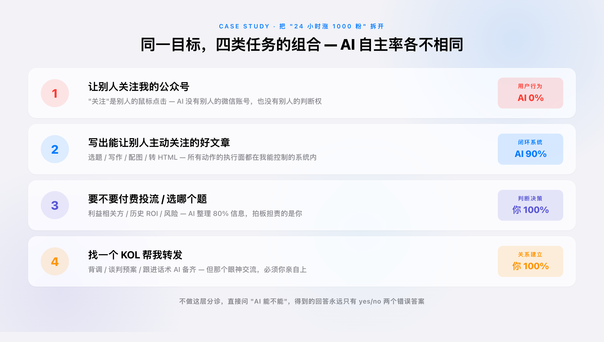
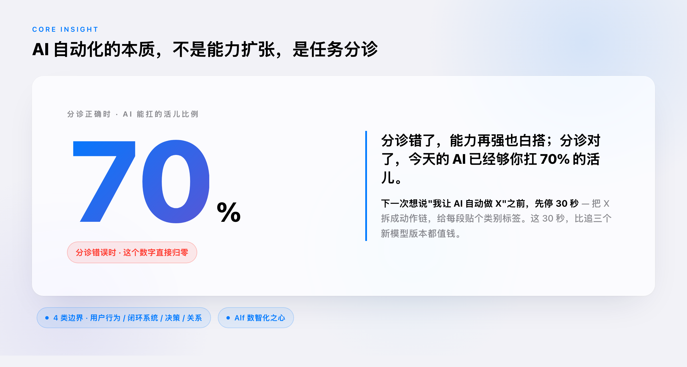

# AI 自动化的四类边界：你大概率分错了类

> 摘要：AI 能不能替你做 X，答案不在 AI 的能力强弱，而在 X 本身的物理结构。分错类别，能力再强也白搭。

---

⚠️ 建议插入个人经历（开篇引子）：昨晚有人确实给作者提了"24 小时让 AI 自动涨 1000 粉公众号关注"的请求。引子文字下面已基于此事件起草，请作者确认是否保留这个具体锚点；如不愿意暴露原始请求，可改写成更脱敏的版本（如"前几天有人来问我能不能让 AI 替他做用户增长"）。

凌晨一点，有人给我提了个需求："你帮我让 AI 给我的公众号自动涨 1000 个关注，24 小时内，我去睡觉，别烦我。"

这个请求里藏着一个类型错误。

不是说"AI 能不能涨粉"——那是技术问题。真正的问题是：他把一件用户主动行为类的任务，当成了闭环系统操作类来发包。这两类任务的边界，决定了 AI 能替你做到几成。

而大多数关于"AI 自动化"的争论，都卡在这条边界上——你以为自己在争"AI 强不强"，其实在争"任务能不能分类"。

## 你以为是能力问题，其实是类型问题

"AI 能替我做 X 吗"——过去三年这个问句被问烂了。从写 PRD 到招人到投资决策，每个职业焦虑都被翻译成同一句话。

回答这个问句的主流姿势分两派：乐观派说"再等两个版本就行"，悲观派说"这种事 AI 永远做不了"。两派都错。因为他们都在争论 AI 的能力上限，而真正决定结果的是任务本身的物理结构。

来看一个具体的例子。"AI 能替我涨 1000 个公众号关注吗"——你的第一反应可能是"如果它够聪明应该可以"。但稍微往里想一步：关注这个动作是别人的鼠标点击，AI 既没有别人的微信账号，也没有别人的判断权。它在物理上够不到这个动作的执行面。

⚠️ 建议插入个人经历：作者自己在过去三个月里遇到过的"想全自动让 AI 做但发现它做不了"的具体场景，越具体越好（最好是一个让你印象深刻的失败案例）。

这不是 AI 不够聪明的问题。再聪明的 AI 也不能替你按下别人的鼠标。

但反过来，"AI 能替我跑完一整天的数据清洗、生成报表、把邮件发出去吗"——这个就完全能做。所有动作的执行面都在你能控制的系统内，AI 物理上够得到。

这两个任务的差别不在难度，在结构。

## 四类边界，每一类都有不可外包的部分

把所有"想让 AI 替我做的事"拆开，会发现它们落在四类结构上，每一类有截然不同的外包率和不可外包责任。

第一类，用户主动行为类。关注、点赞、购买、订阅、写五星好评、点开你的链接——所有依赖外部用户主动决策的动作都在这里。这一类 AI 的执行率是 0%，因为它物理上够不到别人的鼠标和判断权。

但这不等于 AI 无用。这一类的真问题是：你的价值主张够不够让外部用户主动选你。AI 能 100% 替你做的，是把这个价值主张打磨到极致——选题、文案、配图、分发策略、落地页转化率。把这一类塞给 AI"自动执行"，等于把方向盘交给一个看不见路的人。

第二类，闭环系统操作类。写代码、查数据、批处理文件、跑测试、调用 API、生成内容、跨表格做汇总。所有输入、动作、反馈都在你能控制的系统内。

这一类 AI 的执行率可以到 90-100%。这也是 Cursor、Claude Code、Cowork 这些工具真正在吃的市场——把过去需要工程师手动跑的东西自动化掉。但这一类有一个不可外包的部分：审计权。AI 跑完之后，那段代码、那份报表、那批数据有没有错，最后一道关必须是你。把审计权也外包，等于把判断权一起送出去——出事的时候你连自己被坑在哪一步都不知道。

⚠️ 建议插入个人经历：作者自己被 AI"跑完没事，结果后来发现错了"坑过的具体例子（这一段如果有真实案例，杀伤力极强）。

第三类，判断决策类。架构选型、招谁不招谁、定价、要不要止损、要不要砍掉某条业务线、要不要让团队加班——这些决策的后果由你承担。

这一类 AI 的信息整理率能到 70-80%。它可以帮你把所有选项的利弊列清楚、把过去类似决策的参考案例搬出来、把利益相关方的可能反应模拟一遍。但**拍板这件事，结构上不可外包**。不是 AI 不能给意见——它能给非常好的意见。是这件事的问责结构决定了责任不可转移。把决策"完全外包"给 AI 不是高效，是失职——出了事你说"AI 让我这么做的"，没有人会接这个解释。

第四类，关系建立类。说服一个关键的 KOL 帮你转发、谈一笔战略合作、招一个高管、修复一段几乎裂掉的合伙关系。

这一类 AI 的准备率能到 60-70%。背调、谈判预案、对方可能在意的关键利益点、几个版本的开场白、跟进话术，AI 都能替你做到八成精度。但**临门一脚不能假手于人**。核心承诺、那个眼神交流、对方为什么相信你而不是别人，这些是"真人 vs 真人"的不可替代触点。让 AI 替你发了那条关键消息，对方收到的不是"诚意"而是"工业化流水线"——你的关系投资在这一刻被对方降级处理。

## 把任务先分诊，再问"AI 能不能"

回到开篇那个 24 小时涨 1000 粉的需求，套到这个框架里看：

- 让别人关注 → 第一类（用户主动行为），AI 执行率 0%
- 写出能让别人主动关注的好文章 → 第二类（闭环系统），AI 执行率 90%
- 选哪个题、要不要走付费投流 → 第三类（判断决策），AI 整理 80% 信息但你拍板
- 找一个 KOL 帮你转发 → 第四类（关系建立），AI 准备 60% 但你出面

⚠️ 建议插入个人经历：作者过去做过的某次增长动作或某个项目，分别落在哪些类里，可以让框架瞬间长出血肉。

同一个目标，拆完之后是四类任务的组合。每一类的 AI 自动化策略完全不同：第一类要做的是"准备最好的素材"而不是"自动化执行"；第二类放心交给 AI，但你要做审计；第三类让 AI 整理但你拍板；第四类让 AI 准备但你亲自出面。

**所以问题从来不是"AI 能不能替我做这件事"，而是"这件事拆开后落在哪几类，每一类的不可外包责任是什么"。**

不做这层分诊，直接问"AI 能不能"，得到的回答只有两种：一种是"能"——然后你被卡在执行面上动弹不得；一种是"不能"——然后你错过了 AI 本可以替你扛 70% 的部分。

## 给一线落地的判断习惯

这个框架不是用来挂在墙上的，是用来改你下一次"想发包给 AI"时的反应链路。

把"我想让 AI 替我做 X"这句话强行改成两步：

第一步，把 X 拆成动作链。"让 AI 给我涨 1000 粉"拆开是"选题 → 写文章 → 配图 → 转 HTML → 发布 → 多平台分发 → 外部用户看到 → 决定关注"。

第二步，给每个动作贴标签。哪一段是用户主动行为？哪一段是闭环系统？哪一段是判断决策？哪一段是关系建立？

贴完标签你会看见两件事：一是有些段你不该让 AI 做（即使它愿意做）；二是有些段你该让 AI 全做（你还在自己手动操作是浪费）。

⚠️ 建议插入个人经历：作者过去一周里发包给 AI 的任务，按这两步重新分诊，哪些"该外包但没外包"、哪些"不该外包但外包了"。这种自我审视写出来传播性极强。

**AI 自动化的本质不是能力扩张，是任务分诊。** 分诊错了，能力再强也白搭；分诊对了，今天的 AI 就已经够你扛 70% 的活儿。

那些抱怨"AI 还不够强"的人，多半没分诊。那些觉得"AI 帮不上自己什么忙"的人，多半也没分诊。

下一次你想说"我让 AI 替我自动做 X"之前，先停 30 秒，把 X 拆成动作链，给每段贴个类别标签。

这 30 秒，比再追三个新模型版本都值钱。

---

*这是一篇即时观察笔记，源自一次具体的"让 AI 自动涨 1000 粉"的请求。框架还在演进，欢迎在评论区拍砖——你最近一个"想全自动让 AI 帮我做"的请求是什么？落在四类中的哪一类？*

---

### 参考资料

[1] 公众号订阅号 24 小时仅允许群发 1 次的规则，见《微信公众平台运营规范》。⚠️ 未验证——需作者确认引用准确性，可去掉本条或换更稳的来源。

[2] 关于 AI Agent 自主性边界的讨论，可参考 Anthropic《Building Effective AI Agents》（2024），其中"human-in-the-loop"段落与本文"不可外包审计权"观点呼应。⚠️ 未验证完整出处，建议作者亲自核对链接。
