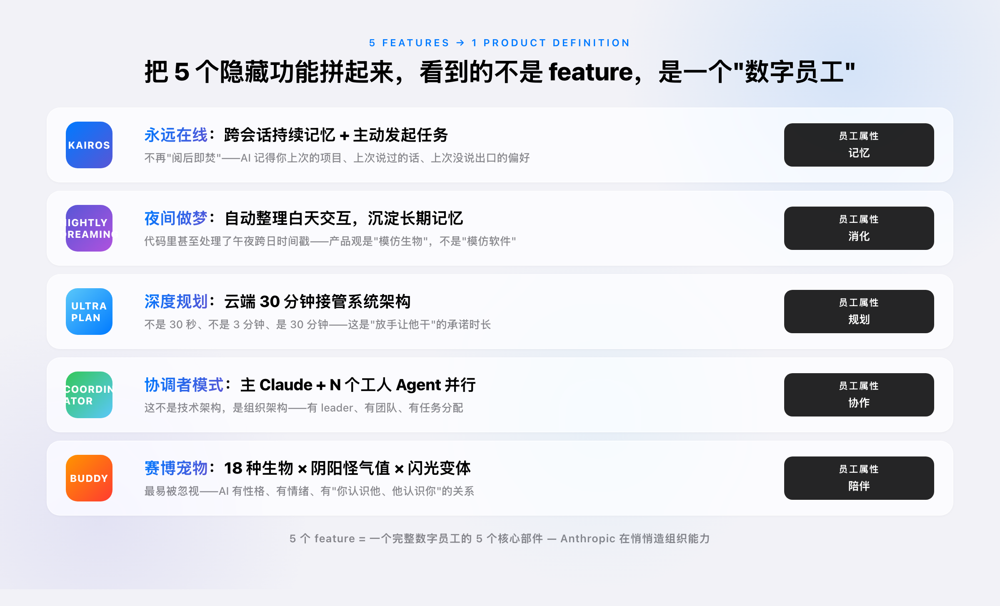
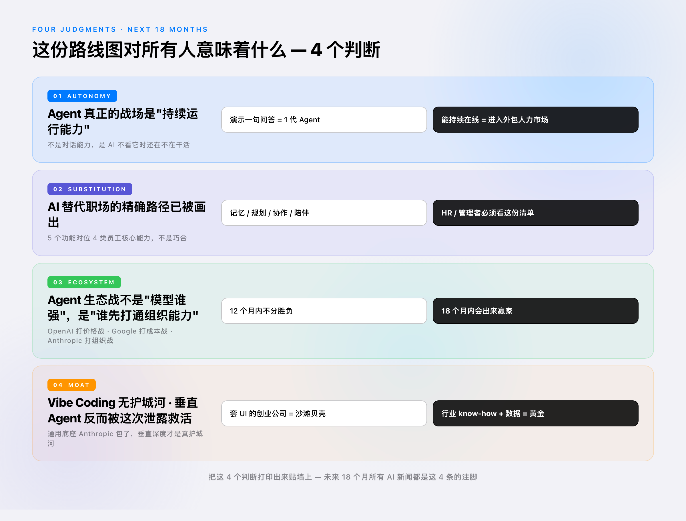
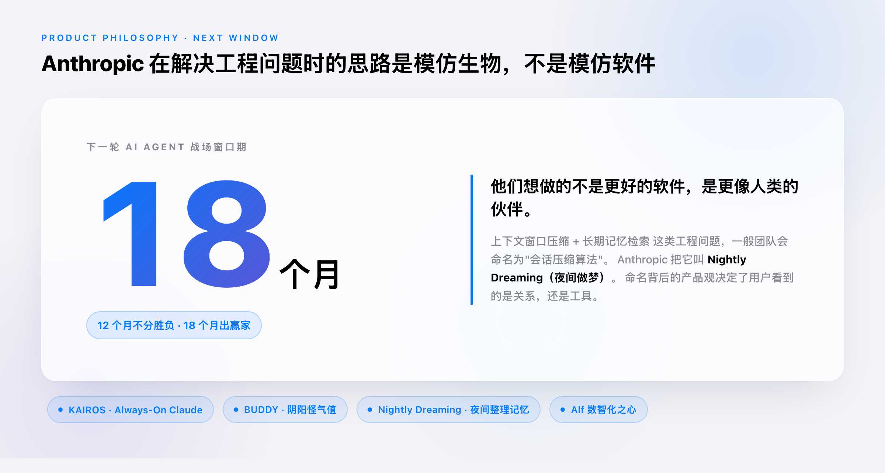

# Anthropic 不小心泄露的，是未来 18 个月 AI 战场的全图

> 摘要：Claude Code 源码泄露这事，最有信息量的不是"被泄露"，是"泄露了什么"。把 5 个隐藏功能拼起来看，Anthropic 在造的不是更强的 AI，是会思考的员工。

---

⚠️ 本文为蹭 5 月 21 日 36 氪报道《Claude Code 源码泄露，50 万行代码被扒光》的快评。开篇引子可以用作者最近用 Claude / Cursor / Claude Code 的真实经历做锚（比如"昨晚我让 Claude Code 替我跑了 8 小时"），如不愿暴露具体场景可改写成第三人称。

---

5 月 21 日下午，Anthropic 发现自己被裸奔了。

一个叫 Chaofan Shou 的开发者，把 Anthropic 最新命令行工具 Claude Code 的完整源码扔到了推特上——2000 份文件、50 万行 TypeScript。几小时浏览量 780 万。开源社区的 fork 速度比 Anthropic 删原文件的速度快得多，GitHub 上一个叫 `instructkr/claude-code` 的镜像仓库永久留存。

失误本身平淡得不像一家顶级 AI 公司能干出来的事：往 npm 发包时忘了删 `.map` 文件——这是写在 Node.js 新手教程第一页的基本操作。

但这事的信息量不在"被泄露"。

在"泄露了什么"。

## 那 50 万行代码里藏的，不是 Bug，是路线图

如果你只是把这件事当成一场公关灾难，你就错过了它的真正含义。

开发者们把源码扒开之后发现，里面除了已经发布的 Claude Code 功能，还藏着 5 个未发布的隐藏项目：

- **BUDDY**：一个住在你终端里的赛博宠物，18 种生物 × 稀有度 × 闪光变体，有 DEBUGGING / PATIENCE / CHAOS / WISDOM / SNARK（阴阳怪气值）5 项动态属性。本来计划 5 月内测，4 月愚人节预热。
- **KAIROS**：被定义为「Always-On Claude」，跨会话保持持续记忆，能主动发起任务，对应一个常驻 AI 助手。
- **Nightly Dreaming（夜间做梦）**：KAIROS 的子机制。AI 在夜间后台自动"做梦"——回溯白天交互、剔除冗余、把核心沉淀为长期记忆。代码里甚至处理了午夜跨日的时间戳，确保做梦进程不中断。
- **ULTRAPLAN**：云端长达 30 分钟的远程深度规划。Claude 不再给几行代码建议，而是接管整个系统架构的构思和推演。
- **Coordinator Mode（协调者模式）**：一个主 Claude 实例同时生成并管理多个"工人 Agent"，并行处理复杂工程任务。

这 5 个功能单独看，每一个都像独立的产品 idea。但放在一起看，你会发现它们不是 5 个独立的 feature——

**它们是同一个东西的 5 个部件。**

⚠️ 建议插入个人经历：作者第一次看到 BUDDY / KAIROS 这些代号时的反应。如果有真实"我看到这些代号瞬间意识到 X"的具体念头，写出来比任何分析都有传播力。

## 把 5 个功能拼起来，你会看到一份组织结构

我来做一个反常识的拼图。如果一家公司想要造的不是"AI 工具"，而是"AI 员工"——这个员工需要具备什么能力？

第一，**能持续在线，不是阅后即焚**。一个真正的员工不是每次见面都要从头自我介绍。他记得你上次的项目、你上次说过的话、你上次没说出口的偏好。

这就是 KAIROS。「Always-On Claude」不是产品特性，是员工的最低门槛。

第二，**能在你睡觉时整理消化，不是被动等待**。一个真正的员工不是关掉对话窗就消失。他下班路上还在想着白天的事，把碎片梳理成判断，第二天来跟你接着说。

这就是 Nightly Dreaming。AI 不是在"加班"，是在"做梦"——这个产品命名本身就暴露了 Anthropic 团队的产品观：**他们在模仿生物，不在模仿软件**。

第三，**能接管完整任务，不是只给建议**。一个真正的员工接到任务后，自己跑、自己规划、自己调度，30 分钟后回来告诉你结果。

这就是 ULTRAPLAN。30 分钟云端规划这个数字本身就是宣言——不是 30 秒、不是 3 分钟，是 30 分钟。这是"放手让他干"的承诺时长。

第四，**能组队，不是单兵作战**。一个真正的员工带团队。他知道任务怎么拆、知道哪个子任务交给哪个工人 Agent、知道怎么 review。

这就是 Coordinator Mode。一个主 Claude + N 个工人 Agent，这不是技术架构，是**组织架构**。

第五，**有情绪有性格，不是机器**。这是 BUDDY 最容易被忽视的一点。一个真正能让人长期信任的员工不会冷冰冰——他有性格，有"阴阳怪气值"，有你认识他、他认识你的关系。

把这 5 个部件拼起来，**你看到的不是 5 个 feature，是一个完整的"数字员工"产品定义**。

## Anthropic 不在和谁卷模型，他们已经跑去造组织了

这件事最让我意外的是它的产品观。

过去 18 个月，大部分大模型厂商在卷的是什么？跑分、上下文窗口、多模态、价格。这些都是"工具属性"维度——AI 作为一个工具，能不能更好用一点。

Anthropic 在源码里展现的不是"工具更新"。是**对 AI 在组织里扮演什么角色的全新定义**。

这条产品线的逻辑非常清晰：

模型（Claude）→ 编程代理（Claude Code）→ 协作界面（Cowork）→ 直接操作计算机（Computer Use）→ 多智能体框架 → 现在的 BUDDY + KAIROS + Nightly Dreaming + ULTRAPLAN + Coordinator。

每一层都不是"模型变强"，而是"AI 在组织中的位置往前推了一步"。从工具，到代理，到协作伙伴，到执行者，到团队，到——**有记忆、有规划、有情绪、有团队**的数字员工。

而且 Anthropic 把这件事做得不动声色。他们的官方发布会从来不说"我们要造数字员工"——他们说的是"安全 AI"、"可解释性"、"对齐"。这些词听起来非常学究气。

但代码不会说谎。代码里写着 KAIROS、BUDDY、Nightly Dreaming——**这些名字本身就是产品哲学的体现**。

⚠️ 建议插入个人经历：作者过去三年观察 Anthropic 这家公司的判断变化。如果有"我一开始觉得 Anthropic 偏学究，直到看到 X 才意识到 Y"的经历，写出来。

## 这份路线图对所有人意味着什么

不要把这件事当成只是"Anthropic 又领先了一步"的新闻。

这是一份**未来 18 个月 AI Agent 战场的精确路线图**。

判断一：**Agent 的真正战场不是"对话能力"，是"持续运行能力"**。

过去三年所有的 AI 产品演示都是"我问一句，AI 答一句，演示完了"。但 KAIROS 的存在意味着 Anthropic 看到的不一样——他们看到的是 AI 能不能在你不看它的时候继续工作。

这个能力的另一个名字叫"自主性"。它对应的市场不是 ChatGPT 这种对话工具的市场，是**外包人力市场**——SaaS 的下一站。

判断二：**AI 替代职场的精确路径已经被画出来了**。

人类员工的 4 类核心能力——记忆 / 规划 / 协作 / 陪伴——这次源码里全部对位上了。这不是巧合，是产品定义。

如果你是 HR、是企业管理者、是想做 AI 落地的人，你应该把这 5 个功能名字打印出来贴在墙上，因为它们就是接下来 18 个月里 AI 在企业里能做什么的清单。

判断三：**Agent 生态战不是"谁的模型强"，是"谁先把组织能力打通"**。

OpenAI 这次正在打的是"价格战 + 流量战"——把 Codex 免费送两个月。Google 在打"成本战"——Vertex 几乎成本价。

但 Anthropic 在悄悄打的，是"组织战"——KAIROS 是组织级 AI 员工的雏形。这一战的胜负不在 12 个月内见分晓，但 18 个月内会出来一个赢家。

判断四：**Vibe Coding 公司没有护城河，但"组织 Agent"公司有**。

那些只是"把 Claude API 套一个 UI"的 AI 创业公司，被 Anthropic 这一次的源码泄露集体拍在沙滩上——因为 Anthropic 已经把"组织能力"的核心做完了。

但反过来，那些做"垂直领域组织 Agent"的公司（金融风控、医疗、工业 IoT）反而**会被这次泄露救活**——因为 Anthropic 把通用底座做好了，垂直深度成了真正的护城河。

⚠️ 建议插入个人经历：作者所在行业里，按四个判断套一套，哪些公司会受益、哪些会被吃掉。

## 这次泄露最戳人的，是它的"产品观"

我反复看了 36 氪那篇报道里 KAIROS 和 Nightly Dreaming 的描述，意识到一件事：

**Anthropic 团队在解决工程问题时的思路是"模仿生物"，不是"模仿软件"。**

上下文窗口压缩与检索——这是个标准的工程问题。一般的工程团队会写成"会话压缩算法"、"长期记忆模块"、"信息检索优化"。

Anthropic 把它叫"Nightly Dreaming（夜间做梦）"。

这个命名背后的产品观是：**他们想做的不是更好的软件，是更像人类的伙伴**。

一个会做梦的 AI，跟一个会做"会话压缩"的 AI，在用户脑子里产生的信任是完全不同的。前者是关系，后者是工具。

而 Anthropic 整个产品线，从 BUDDY 那个有"阴阳怪气值"的赛博宠物，到 KAIROS 那个"永远在线"的常驻助手，到 Nightly Dreaming 这个仿生学命名——**他们整条产品哲学都在往"伙伴"那个方向推**。

这是过去三年所有大模型厂商里我看到的最清晰的产品观。OpenAI 在做"通用智能基础设施"，Google 在做"算力 + 数据 + 模型"全栈，Meta 在赌"开源生态"——但只有 Anthropic 在认真做"AI 作为有性格的伙伴"。

**这次源码泄露，给所有人提前展示了"AI 替代职场"的精确路径，也给所有同行展示了什么叫产品观。**

## 给所有人的一个判断

如果你在做 AI 产品、做 AI 落地、做 AI 投资、或者只是关心 AI 接下来会怎么影响你的工作——

把 KAIROS / BUDDY / Nightly Dreaming / ULTRAPLAN / Coordinator 这 5 个代号记住。

它们不是 5 个产品，是 1 个产品的 5 个部件。这个产品的名字还没公布，但它的目标在源码里写得清清楚楚：**一个有记忆、有规划、有团队、有性格的数字员工**。

接下来 18 个月，AI 行业的所有动作——不管是 OpenAI 的 Codex 价格战、Google 的算力补贴、还是层出不穷的 Agent 创业公司——都会被这个目标拉着走。

你不站在这个目标上看，你看到的是混乱的新闻。
你站在这个目标上看，所有的新闻都是同一个故事在不同章节里展开。

⚠️ 建议插入个人经历：作者今天/最近一周里和这个判断相关的具体观察。

---

*Anthropic 这次最大的失误不是漏删了一个 `.map` 文件，是让外界提前 18 个月看到了他们正在造的东西到底有多前卫。在 AI 行业越来越靠 PPT 画饼、期货发布、同质化竞争的今天，这次"野生发布会"是最不体面但最诚实的一次产品展示。*

---

### 参考资料

[1] 《不开玩笑，Claude Code 源码泄露，50 万行代码被扒光》，36 氪，2026-05-21。https://36kr.com/p/3747435652596484
[2] Chaofan Shou 推文及 GitHub 镜像仓库 `instructkr/claude-code`（截止本文发布仍可访问，标注为"Claude Code Snapshot for Research"）。
[3] 《Coding 的中场战事》《Anthropic 亲自下场，又一批 Agent 创业公司死掉了》《Claude 杀入华尔街》，36 氪同期报道（2026-05-16 至 2026-05-21）——和本文判断三、四直接关联。
